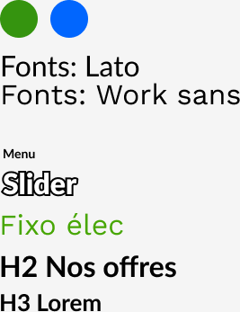

# Design & Integration: Énergem (revamping)

_August - September 2022_

> 🔨 Revamping of an existing website ([Énergem](https://www.energem.fr/)). The design has been made using Figma and Adobe Illustrator during my Web-design training at Sirius School. Integration uses HTML, CSS3 and JS (no framework).

---

The website is responsive and the drop down menu, slider and burger menu are working.

Result can be seen here on the Gihub pages:

- [Homepage](https://raigyo.github.io/webdesign-integration-energem/)
- [Level 2](https://raigyo.github.io/webdesign-integration-energem/page.html)

## Figma web design project

Figma file (.fig): [Download](_sources/Energem.fig)

### Homepage

### Level 2 page

### Slider

### Drop down menu

### Charter for front-end developer

## Integration process (Grid using dev tools)

## Final result (afet HTML / CSS integration)

### Homepage

### Level 2 page

### HP Mobile

## Useful links

- [Vanilla JS Image Carousel With Smooth Crossfade Transitions | CSS Script](https://www.cssscript.com/image-carousel-crossfade/)
