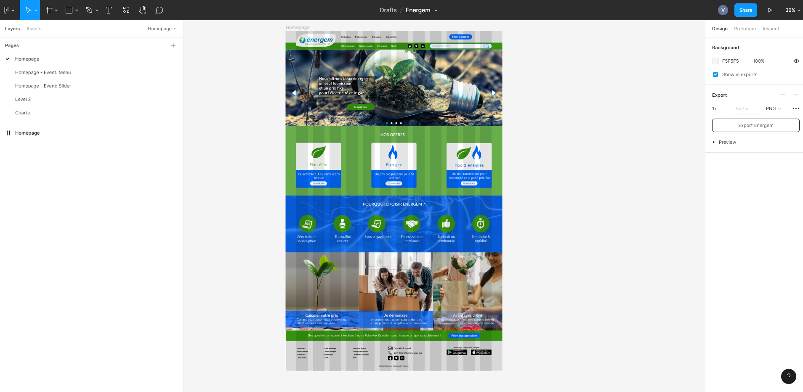
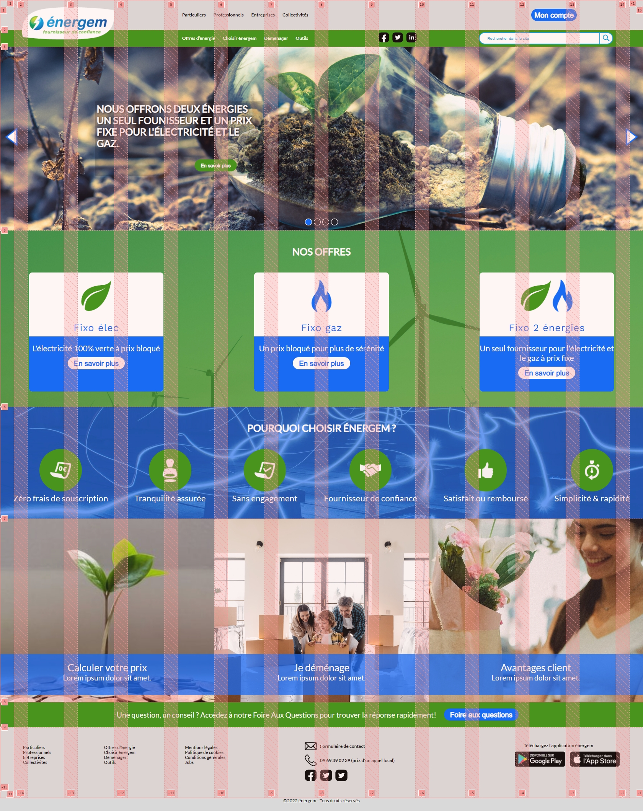
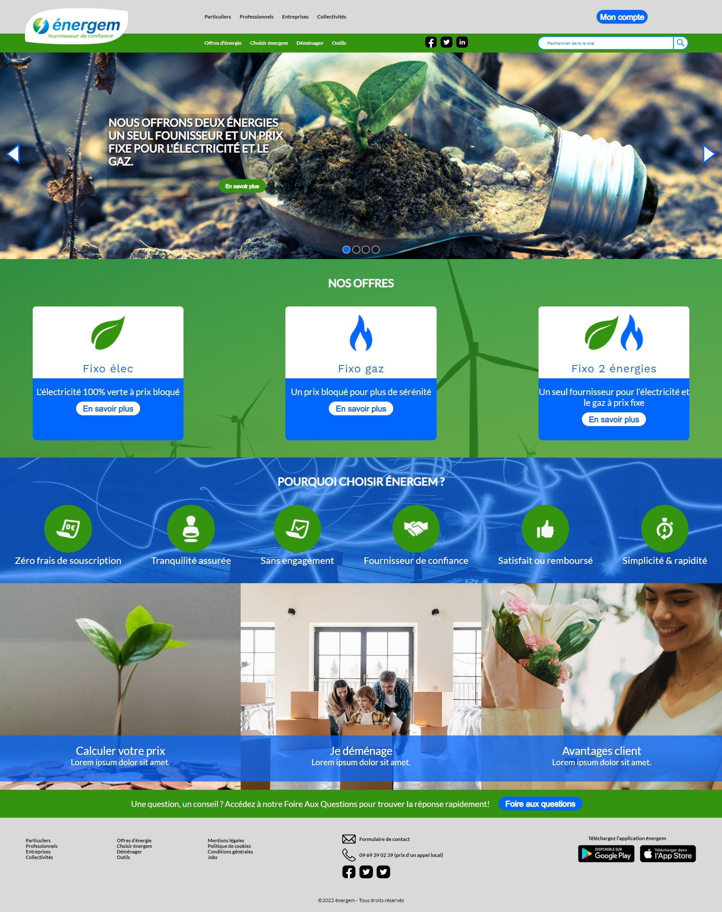
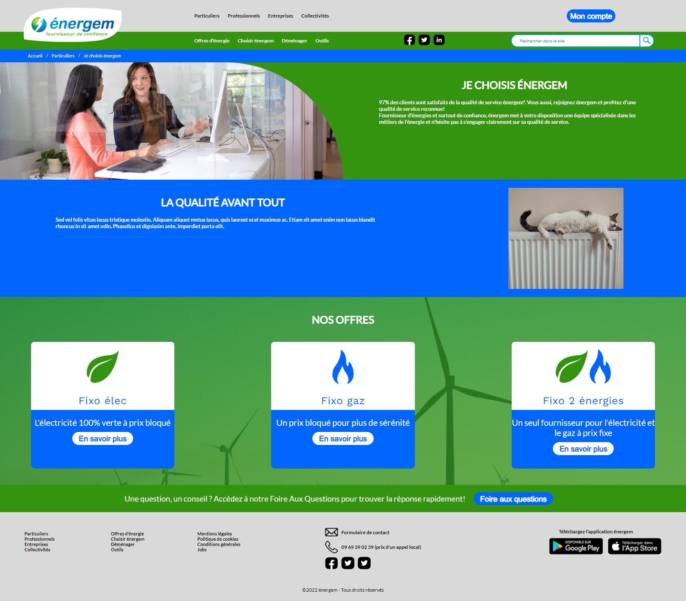
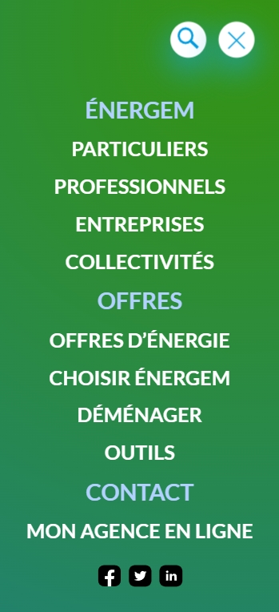

# Design & Integration: Énergem (revamping)

_August - September 2022_

> 🔨 Revamping of an existing website ([Énergem](https://www.energem.fr/)). The design has been made using Figma and Adobe Illustrator during my Web-design training at Sirius School. Integration uses HTML, CSS3 and JS (no framework).

---

The website is responsive and the slider and the burger menu are working.

Result can bee seen here:

[Homepage](https://raigyo.github.io/webdesign-integration-energem/)

[Level 2](https://raigyo.github.io/webdesign-integration-energem/page.html)

Figma file (.fig)

[Download](_sources/Energem.fig)

## Figma project

## Integration process

## Final result

### Homepage

### Level 2 page

### HP Mobile

## Useful links

- [Vanilla JS Image Carousel With Smooth Crossfade Transitions | CSS Script](https://www.cssscript.com/image-carousel-crossfade/)
